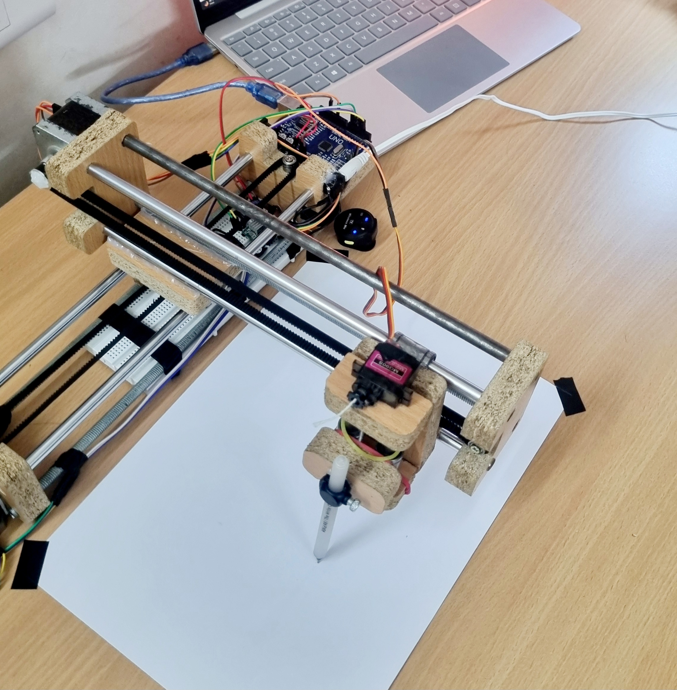

# ✍️ Scribble-Tron: The DIY Writing Robot

Scribble-Tron is a compact, open-source writing bot designed to draw complex vector images and text using CNC principles. By combining a simple Arduino setup with stepper motors and G-code control, it offers a low-cost solution for automated writing and sketching.

---

## 📥 Downloads

| Tool / File | Link |
|-------------|------|
| 🧠 Arduino Firmware (GRBL + Servo) | [firmware/grbl-servo-master.zip](./firmware/grbl-servo-master.zip) |
| 🖼️ Inkscape Extension (for G-code export) | [software/extension_mi_inkscape.zip](./software/extension_mi_inkscape.zip) |
| 🛠️ Arduino IDE | [arduino.cc/en/software](https://www.arduino.cc/en/software) |
| 🎮 Universal G-code Sender (UGS) | [winder.github.io/ugs_website/](https://winder.github.io/ugs_website/) |
| 📋 Bill of Materials | [bom/BOM.md](./bom/BOM.md) |

---

## 🧰 Getting Started

### 1. Arduino Setup
- Download and install [Arduino IDE](https://www.arduino.cc/en/software)
- Install the GRBL firmware:
  - Go to `Sketch > Include Library > Add .ZIP Library`
  - Select `grbl-servo-master.zip` from the `/firmware` folder
- Open `File > Examples > grbl-servo > grblUpload`
- Select your board (Arduino UNO) and upload the sketch

### 2. Preparing the Drawing
- Install [Inkscape](https://inkscape.org/)
- Add the extension from `/software/extension_mi_inkscape.zip` to your Inkscape extensions folder:
  - On Windows: `C:\Users\YourName\AppData\Roaming\inkscape\extensions`
- Use Inkscape to create your vector design and export it as G-code

### 3. Sending G-code to the Bot
- Open [Universal G-code Sender](https://winder.github.io/ugs_website/)
- Connect your Arduino via COM port
- Load the `.gcode` file exported from Inkscape
- Click "Send" to start plotting!

---

## 🔧 Features

- Draw vector art and text
- G-code compatibility
- Pen up/down using servo motor
- Simple 2-axis CNC platform

---

## 📷 Preview

| The Bot in Action |
|-------------------|
|  |

---

## 🧾 Bill of Materials

Full component list with prices and links:  
→ [BOM.md](./bom/BOM.md)  
📄 [Google Sheets Version](https://docs.google.com/spreadsheets/d/1JKwAK4Ukw1zefZA47349bDCX6iBTZpc3zfQlEFtP45Q/edit?usp=sharing)

---

## 🧠 About the Project

The Scribble-Tron project aims to develop a writing machine that can render complex designs and text as input. By leveraging Computer Numerical Control (CNC) technology, it enhances precision, repeatability, and efficiency in design replication.

---

## 💡 License

This project is licensed under the MIT License.  
See the [LICENSE](./LICENSE) file for more info.
